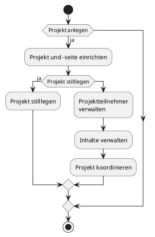

# Activity Diagram

## Chief-Contant-Creator (CCC)

Für die Veröffentlichung eines Beitrags auf der Website "Dino-Book" ist ein aktives Projekt erforderlich. Innerhalb dieses Projekts können mehrere Benutzer ihre Inhalte mit der Gemeinschaft von "DinoBook" teilen. Jedes Projekt erfordert einen Projektleiter, der folgende Aufgaben übernimmt:

- [das Projekt einrichtet](https://github.com/DBsMOJO/SYP-DinoBook/blob/main/ActivityDiagram_PEr.md)
	- das Projekt anlegt
	- die Projektseite gestaltet
	- ggf. ein Priviläg einer fakultären Organisation freischaltet
- **das Projekt verwaltet**
	- [die Projektteilnehmer verwaltet](https://github.com/DBsMOJO/SYP-DinoBook/blob/main/ActivityDiagram_PVw.md)
	- [den Contant verwalten](https://github.com/DBsMOJO/SYP-DinoBook/blob/main/ActivityDiagram_CVw.md)
	- [die Projekte zu koordinieren](https://github.com/DBsMOJO/SYP-DinoBook/blob/main/ActivityDiagram_PKoo.md) (Pinnwand)
	- die Bibliotheken verwaltet (Mediathek, Funddokumentationen)
- [das Projekt stilllegen](https://github.com/DBsMOJO/SYP-DinoBook/blob/main/ActivityDiagram_PSl.md)

