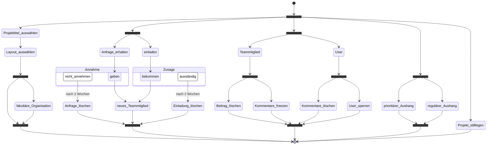

# Activity Diagram

## Chief-Contant-Creator (CCC)

Für die Veröffentlichung eines Beitrags auf der Website "Dino-Book" ist ein aktives Projekt erforderlich. Innerhalb dieses Projekts können mehrere Benutzer ihre Inhalte mit der Gemeinschaft von "DinoBook" teilen. Jedes Projekt erfordert einen Projektleiter, der folgende Aufgaben übernimmt:

- **das Projekt einrichtet**
	- das Projekt anlegt
	- die Projektseite gestaltet
	- ggf. ein Priviläg einer fakultären Organisation freischaltet
- **das Projekt verwaltet**
	- die Projektteilnehmer verwaltet
	- den Contant verwalten
	- die Projekte zu koordinieren (Pinnwand)
	- die Bibliotheken verwaltet (Mediathek, Funddokumentationen)
- **das Projekt stilllegen**

