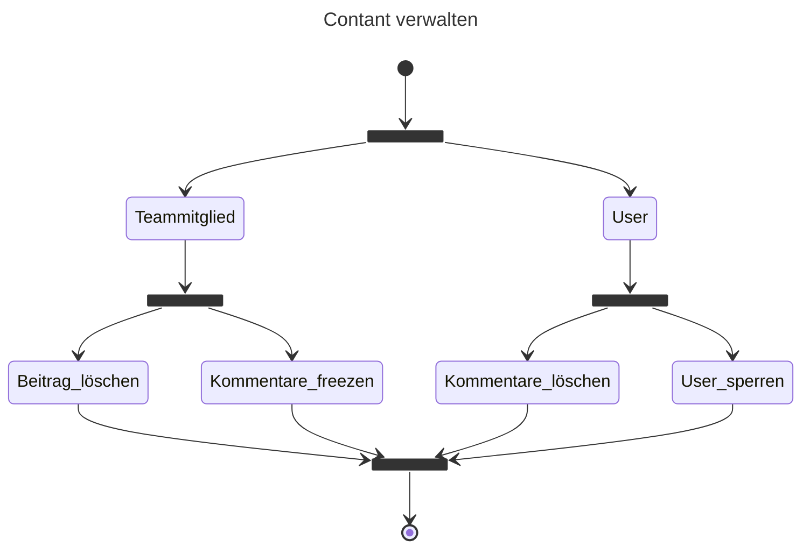

#### Verwaltung von Inhalten

Als Sittenwächter hat der CCC die Befugnis, Gastkommentare zu löschen oder Benutzer außerhalb des Projektteams zu sperren, sodass sie das Projekt nicht mehr verfolgen können. Der CCC kann auch bei Bedarf die Kommentarfunktion von Projektteilnehmern einfrieren, sodass sie keine weiteren Projektbeiträge mehr veröffentlichen können. Darüber hinaus kann der CCC auch Projektpostings anderer Projektteilnehmer von der Projektseite entfernen.

