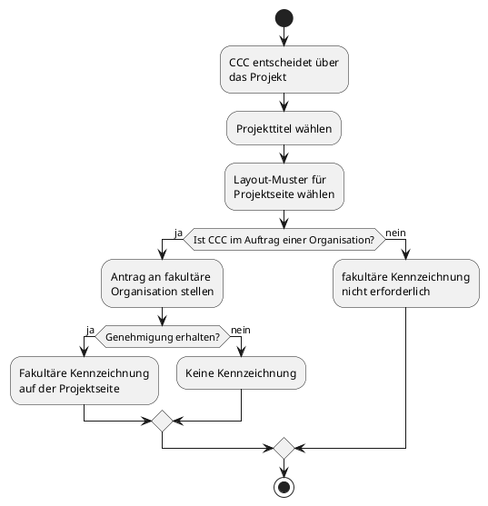

### Projekt einrichten

Bei der Erstellung des Projekts wählt der CCC:

- einen Projekttitel
- eines der (drei) vorgeschlagenen Layout-Muster für die Titelseite des Projekts

Falls der CCC nicht als regulärer Benutzer (Einzelperson) handelt, sondern im Auftrag einer fakultären Organisation ein Projekt organisiert, kann er einen Antrag an die fakultäre Organisation stellen. Bei Genehmigung erhält das Projekt einen "blauen Zertifizierungshaken", der die dahinterstehende Organisation ausweist und als "Gütesiegel" von DinoBook anerkannt wird.

