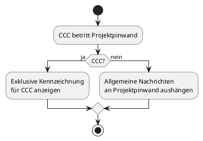

#### Projekte koordinieren

Auf der Projektpinwand, die den Projektteilnehmern für allgemeine Kommunikation untereinander dient, bekommt der CCC einee exkusive Kennzeichnung. Auch kann der CCC "Allgemeine Nachrichten" aushängen, wie etwa Termine, Kodex, Adressen, etc.

