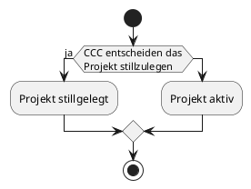

### Projekt stilllegen

Der CCC kann jederzeit das Projekt stilllegen.

```plantuml
@startuml
start
if (CCC entscheiden das\nProjekt stillzulegen) then (ja)
    :Projekt stillgelegt;
else
    :Projekt aktiv;
endif;
stop
@enduml
```

