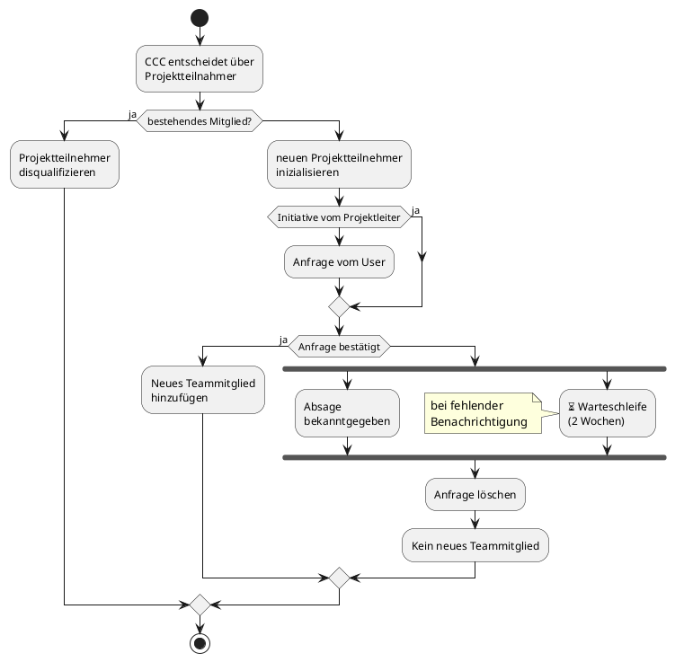

# Verwaltung der Projektteilnehmer

Der CCC hat die Möglichkeit, andere Benutzer (Projektteilnehmer) zur Teilnahme an diesem Projekt einzuladen oder erhält Anfragen von Freiwilligen, die am Projekt teilnehmen möchten. Der CCC kann auch einzelne Personen vom Projekt ausschließen, wenn sie sich disqualifizieren.

